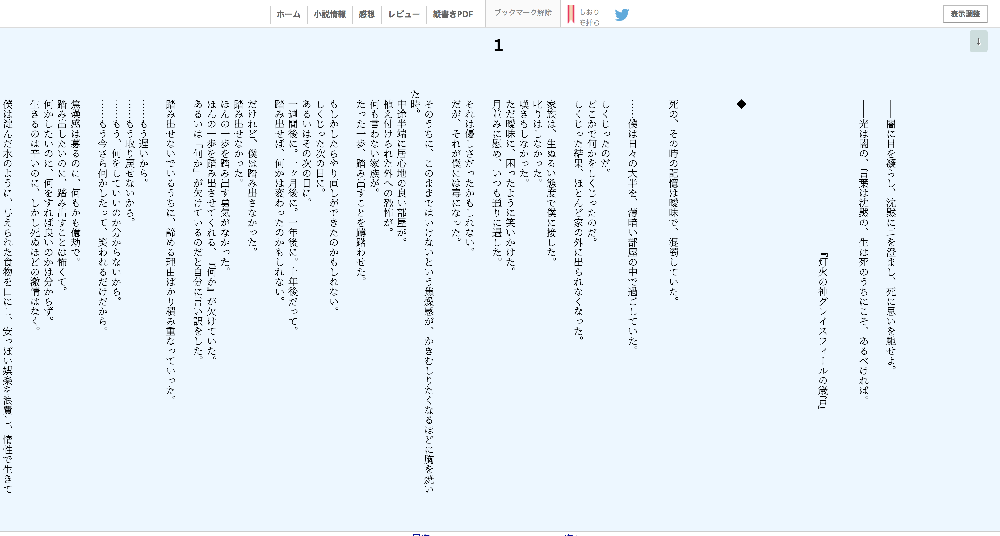

# 縦書きになろう

- 小説家になろうを縦書きで読みやすくします。
- カクヨムも縦書きになります。
- キーボードショートカットもあります。
  

# 使い方

[Chromeウェブストア](https://chrome.google.com/webstore/detail/%E7%B8%A6%E6%9B%B8%E3%81%8D%E3%81%AB%E3%81%AA%E3%82%8D%E3%81%86/eaokpigogcoahjjgkdgcaldgcbdfbdei)からインストール

# 開発者向け

1.  ```
    pnpm i
    ```
2.  ```
    pnpm run dev
    ```
3.  アドレスバーに`chrome://extensions/`を入力
4.  `デベロッパーモード`をONにする
5.  `パッケージ化されていない拡張機能を読み込む`で、`.output/chrome-mv3`フォルダを選択
