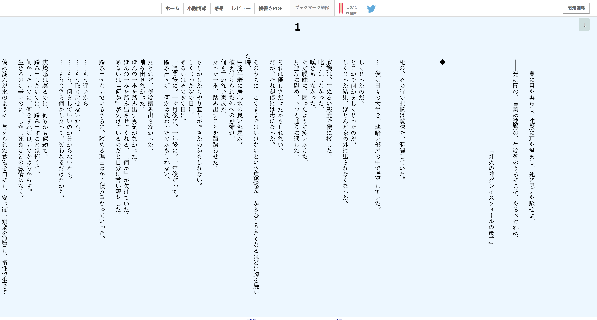

# tategaki-ni-narou
* 小説家になろうを縦書きで読みやすくします。
* カクヨムも縦書きになります。
* キーボードショートカットもあります。

# How to use
1. アドレスバーに`chrome://extensions/`を入力
2. `デベロッパーモード`をONにする
3. `パッケージ化されていない拡張機能を読み込む`で、`extension`フォルダを選択

## キーボードショートカット
| キー | コマンド |
|--|--|
| ← | すこし左にスクロール |
| → | すこし右にスクロール |
| Shift+← | 半画面分左にスクロール |
| Shift+→ | 半画面分右にスクロール |
| PageDown Space | １画面分左にスクロール |
| PageUp Shift+Space | １画面分右にスクロール |
| N | 次の話へ移動 |
| P | 前の話へ移動 |
| B | しおりを挟む |
| M | マイページへ戻る |